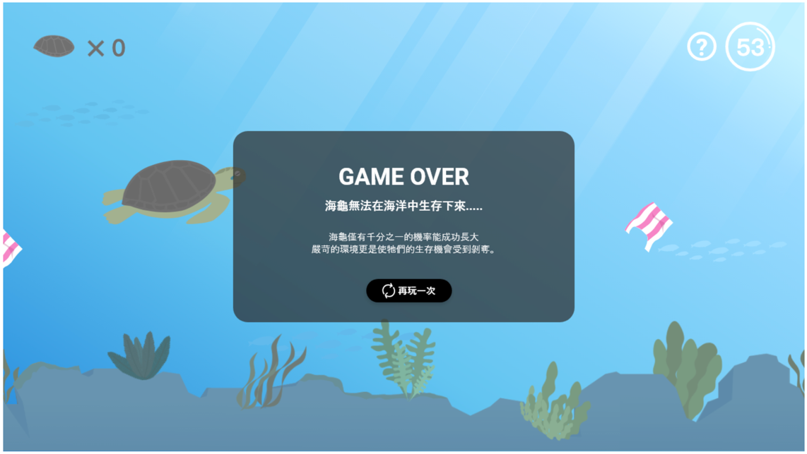

# THE F2E 2nd Week 5 : 90 秒小遊戲

## 美術設計稿
- https://xd.adobe.com/spec/867dd825-3841-42a1-5edf-85136dae2153-f04c/grid

## DEMO
 - [完成範例](https://guanwha.github.io/f2e2019-week5-90sgamesimple/)
 - 

## 操作
 - 鍵盤的上左右控制方向
 - 滑鼠(Touch)點擊拖曳控制方向
 - 遊戲補充說明
    1. 遊戲中，點擊右上方提示，可以同時暫停
    2. 只要頭部避開障礙物即可通過

## 框架
 - [phaser3](https://phaser.io/)
